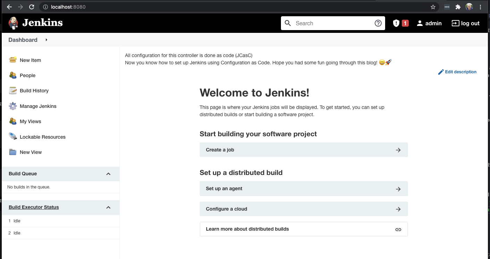

# Jenkins inception: configuring Jenkins to configure Jenkins
*By Marc Goossens, September 2021*

Jenkins is an open source automation server that development teams use to build, test and deploy their applications. If you have worked in an environment with CI/CD pipelines, chances are that you have used Jenkins. And because Jenkins has so many configuration options and plugins available, it can be quite an effort to set up.

Now imagine configuring all of your infrastructure *as code*, but configuring the tool that builds, tests and deploys your infrastructure and applications *through a web UI*. Sounds counterintuitive, right? In this blog, I’ll show you how to configure Jenkins as code. The next blog in this series, I’ll talk about even setting up your pipeline configuration in a fully automated, version controlled way. If you already know why you use Jenkins, you can skip the first paragraph:
1. (Blog 1/2) Why a build server, and why Jenkins?
1. (Blog 1/2) Jenkins: Configuration as Code (JCasC) plugin
1. (Blog 1/2) Automating Jenkins configuration with Docker and JCasC
1. (Blog 2/2) Automating pipeline setup: Jenkins Job DSL plugin
1. (Blog 2/2) Why I did not get the ‘perfect’ setup running yet..

While I went through this setup for a Jenkins controller, I did not find everything to be as clear or well-documented as I would have wished. Hopefully this article will clear some things up! *[Find the code repository here](https://github.com/m-goos/jenkins-configuration-as-code-blog)*, in the `Blog 1` folder.


*How deep do you want to go down the Configuration as Code rabbit hole? [Maxime Lebrun](https://unsplash.com/photos/1o2071GOVp0) on Unsplash*

*Prerequisites: some basic experience with Docker and Jenkins, see [Jenkins Tutorials](https://www.jenkins.io/doc/tutorials/) and [Docker getting started](https://docs.docker.com/get-started/). You can choose to code along with this blog, or to simply pull the repository. All final files are supplied in the `blog1-code` folder.*

# Why a build server and why Jenkins?
The reason to set up a CI/CD pipeline is simple: to automate deployment of your projects, and to standardize your process of deploying to production, configured to your needs. Here’s a little example I drew in *excalidraw*:


Using a build server just makes your life easier - once your CI/CD process is set up that is. Once your automatic builds start coming through whenever you push code changes, you’ll find out how rewarding it is to see your code *live* just minutes after.

Now why Jenkins? There are many ways to set up a CI/CD pipeline, to name a few from major cloud and software providers:
- Github Actions
- Gitlab CI/CD pipelines
- Bitbucket Runners / Pipelines or Atlassian Bamboo
- AWS Codepipeline
- Spinnaker (Netflix)
- And the list goes on..

The reason I am choosing Jenkins here is because it is widely supported, considered to be an industry standard, open source and highly configurable. This blog is not a comparison of CI/CD tools however, so I won’t go into details. If you have a small project, it doesn’t pay off to set up Jenkins - you will not need the configurability for Continuous Integration. In that case I’d recommend quickly setting up your pipeline through Github, Gitlab or AWS. I’m not saying those aren’t highly configurable, but they are just simpler to set up for small projects.

With the right configuration scripts, it becomes really quick to set up Jenkins. Let’s move on to that setup!

# Jenkins Configuration as Code (JCasC)
Configuring a Jenkins controller or agent can be a hassle, as there are many different plugins and many steps to configure before a Jenkins pipeline runs, things like:
- installing plugins,
- checking out your code repositories,
- configuring users and various credentials,
- deploying the build.

Now you could write Groovy scripts to directly invoke the Jenkins API for the desired configuration, but that requires advanced knowledge of the Jenkins API. For my case, investing in this kind of knowledge was simply not worth it. 

A good alternative is the Jenkins Configuration as Code [plugin](https://github.com/jenkinsci/configuration-as-code-plugin), JCasC for short. The JCasC plugin allows the user to define all the configuration options for the Jenkins instance as code, in a `yaml` file. That configuration file would then look something like this:

`jenkins-configuration.yaml` ([github](https://github.com/m-goos/jenkins-configuration-as-code-blog/blob/main/blog1-code/jenkins-configuration.yaml)):

```​​
jenkins:
  systemMessage: "All configuration for this controller is done as code (JCasC)"
  securityRealm:
    local:
      allowsSignup: false
      users:
      - id: "admin"
        password: "${JENKINS_ADMIN_PASSWORD}" # passing ENV variable from Docker here
        properties:
        - timezone:
            timeZoneName: "Europe/Amsterdam"
  authorizationStrategy:
    globalMatrix:
      permissions:
        - "Overall/Administer:admin"
        - "Overall/Read:authenticated"
  remotingSecurity:
    enabled: true
security:
  queueItemAuthenticator:
    authenticators:
    - global:
        strategy: triggeringUsersAuthorizationStrategy
unclassified:
  location:
    url: http://localhost:8080
```

This configuration file can then be checked into git, giving you an editing history of your configuration. Defining your configuration as code provides the same advantages Infrastructure as Code does. One aspect is auditability, because all configuration is explicit and can thus be checked for e.g. security concerns. Another aspects is repeatability, because the instance can be easily redeployed, duplicated and version controlled. [The list goes on](https://techspire.nl/why-infrastructure-as-code/)...

With a first configuration file ready, it is time to prepare a Docker container with a customized Jenkins instance.

## Automating Jenkins configuration with Docker and JCasC
For this step you’ll need to have Docker installed and tested. If you are new to Docker, you could start with the examples from the Docker tutorials. The goal is to run a customized Jenkins container with Docker, with the Configuration as Code plugin,  automatically set up and ready to go. This is an overview of the steps to take, detailed below:

Create a new folder for the following 3 files:
1. `Dockerfile`: Create a Dockerfile to define the configuration of the Jenkins container.
2. `plugins.txt`: List the necessary plugins for Jenkins in this file.
3. `jenkins-configuration.yaml`: copy the code snippet above, or write your own.
4. Pull, Build & Run the custom Jenkins container!


*Contents of the new folder*

Once the Jenkins instance is running successfully locally, you might want to run the Jenkins container on e.g. Azure, AWS or GCP - but that's another story.

### Step 1: Create a Dockerfile 
For creation of the container, there are a couple steps. Looking at the Dockerfile below line by line, you:
1. `FROM`: Specify the Docker image to build, from the latest Jenkins image on your local machine
2.`ENV` Set the environment variable that determines whether the Jenkins setup wizard will be run to false. This is not necessary, because the configuration comes from the `jenkins-configuration.yaml` script.
3. `ENV` Set the environment variable that tells the Jenkins Configuration as Code plugin where to find its configuration.
6. `COPY` the configuration file into the container
4. `COPY` a list of `plugins` from the local machine into the container.
5. `RUN` the script that installs the necessary plugins, such as the `Configuration as Code` plugin!

**Dockerfile** ([github](https://github.com/m-goos/jenkins-configuration-as-code-blog/blob/main/blog1-code/Dockerfile)):
```zsh
FROM jenkins/jenkins:latest
ENV JAVA_OPTS -Djenkins.install.runSetupWizard=false
ENV CASC_JENKINS_CONFIG /var/jenkins.yaml
COPY plugins.txt /usr/share/jenkins/ref/plugins.txt
RUN /usr/local/bin/install-plugins.sh < /usr/share/jenkins/ref/plugins.txt
COPY jenkins-configuration.yaml /var/jenkins.yaml
```

The order here is crucial, because the plugins cannot be automatically installed before a list of required plugins is into the container.

The `copy` step with the plugins.txt, make sure to include the configuration as code plugin.

### Step 2: List the necessary plugins
Create a file `plugins.txt` in the folder, with for example the following plugins:

```
ant:latest
antisamy-markup-formatter:latest
authorize-project:latest
build-timeout:latest
cloudbees-folder:latest
configuration-as-code:latest
credentials:latest
email-ext:latest
git:latest
gradle:latest
job-dsl:latest
ldap:latest
mailer:latest
matrix-auth:latest
nodejs:latest
pam-auth:latest
pipeline-stage-view:latest
ssh-slaves:latest
timestamper:latest
workflow-aggregator:latest
ws-cleanup:latest
```

The list is sourced and adapted to basic needs from the [Jenkins Github repository](https://github.com/jenkinsci/jenkins/blob/master/core/src/main/resources/jenkins/install/platform-plugins.json). Have a peak there to make sure you include the plugins you need - for now this will suffice. The `job-dsl` plugin is included here as it will be necessary for the next blog in this series. 

As a final remark: For production, you might want to specify a version for every plugin, not ‘latest’, to ensure stability when rebuilding your Jenkins image. The plugins are then installed with this command from the Dockerfile: `RUN /usr/local/bin/install-plugins.sh < /usr/share/jenkins/ref/plugins.txt` ([details](https://github.com/jenkinsci/docker#preinstalling-plugins)).

### Step 3: Create configuration file
A very basic configuration file would be as provided in this blog, scroll up to copy from `jenkins-configuration.yaml`. Now create that file in your root folder, or feel free to experiment with a more elaborate configuration file from the [JCasC repository](https://github.com/jenkinsci/configuration-as-code-plugin#introduction).

### Step 4: Pull, Build & Run custom Jenkins image
Start Docker's UI or the docker-daemon from your command line. To check if docker is running, in your command line try something like this:
```zsh
$ docker images
$ docker ps
```

This should list any images you have, or currently running containers. Next, pull the latest Jenkins image:
```zsh
$ docker pull jenkins/jenkins:latest
```
Alternatively, you could choose to download a Jenkins Long Term Support or LTS release, for example for stabilization. But let's not get into that for this blog.

Next, make sure your terminal is in the folder you have been creating the necessary files for, and then we are at the final step: to build and run the docker image!

The `docker build` command gets the following options:
- [OPTION] `-t` to tag the images
- [PATH] `.` to build from the Dockerfile from the current directory

```
$ pwd 
/Users/marc/projects/jenkins-configuration-as-code-blog/blog1-code

$ docker build -t jenkins:jcasc-blog-1 .

[+] Building 36.3s (9/9) FINISHED                                                                      
 => [internal] load build definition from Dockerfile
 => => transferring dockerfile: 343B
 => [internal] load .dockerignore
 => => transferring context: 2B
 => [internal] load metadata for docker.io/jenkins/jenkins:latest
 => CACHED [1/4] FROM docker.io/jenkins/jenkins:latest
 => [internal] load build context
 => => transferring context: 791B
 => [2/4] COPY plugins.txt /usr/share/jenkins/ref/plugins.txt
 => [3/4] RUN /usr/local/bin/install-plugins.sh < /usr/share/jenkins/ref/plugins.txt
 => [4/4] COPY jenkins-configuration.yaml /var/jenkins.yaml
 => exporting to image
 => => exporting layers
 => => writing image sha256:af23bd83c660cf50f4dd09c3badd9850c75f1e9e51bc882f1ca6f5116b8ddd02
 => => naming to docker.io/library/jenkins:jcasc-blog-1

$ docker images
REPOSITORY        TAG            IMAGE ID       CREATED         SIZE
jenkins           jcasc-blog-1   af23bd83c660   3 minutes ago   517MB
jenkins/jenkins   latest         482543872bd9   6 days ago      441MB
```

After successfully building, it is time to run the image. The `docker run` command gets the following options:
- [OPTION] `--name` to name the image
- [OPTION] `--rm` to automatically remove the container when it exits
- [OPTION] `-d` to start a container in detached mode
- [OPTION] `-p` to publish or expose port
- [OPTION] `--env` to pass an Environment Variable
- [IMAGE] the image to run
```
$ docker run --name jenkins --rm -p 8080:8080 --env JENKINS_ADMIN_PASSWORD=password jenkins:jcasc-blog-1
```

Wait a second, and this should be successful! If you would inspect your container (`docker exec`), you should see something like this: `$ Jenkins is fully up and running`. Go to `http://localhost:8080`, login with username admin and `password` as password and enjoy!




Finally, to clean up, stop the process of the running container using `ctrl + c` and remove the docker image you built:
```zsh
$ docker images
REPOSITORY        TAG            IMAGE ID       CREATED          SIZE
jenkins           jcasc-blog-1   af23bd83c660   36 minutes ago   517MB
jenkins/jenkins   latest         482543872bd9   6 days ago       441MB

# remove images
# docker rmi [OPTIONS] IMAGE [IMAGE...]
$ docker rmi af23bd83c660 482543872bd9
Untagged: jenkins:jcasc-blog-1
Deleted: sha256:af23bd83c660cf50f4...
Untagged: jenkins/jenkins:latest
Untagged: jenkins/jenkins@sha256:0...
Deleted: sha256:482543872bd95ba0a4...
```
## Final thoughts
The code in this blog is a very simple example, but that is the point: To get started with Jenkins Configuration as Code. It provides a jumping board to get you started, so please feel free to play around with this setup as well! It is pretty amazing when you can simply spin up a fully configured Jenkins container like this. 

A step towards running Jenkins in production would be to take this container to the cloud, for example to upload your image the AWS Elastic Container Registry, and then to run it using the AWS container service (ECS/Fargate). There are some big steps there, such as setting up all network resources and exposing that container to the internet, but all that can be done as code as well.

Some of the most valuable resources for me are the Configuration as Code repository and the blog of [Tom Gregory](https://tomgregory.com/jenkins-tutorials/).


## Next level: automating job setup
A very useful and cool step is when all the necessary pipeline jobs are set up automatically. This is what I'll show in the next blog in this series. I'll show how to specify credentials to a git repository that holds the pipeline scripts to automate this setup, and how to use the `Job DSL plugin` to.. well, to automate the automation 

I hope you enjoyed this blog and have a good use case for this awesome Jenkins plugin with its features - please feel free to reach out with any feedback you have.

## Who am I?
I’m Marc, a full stack engineer at Techspire and I ride my bike in Amsterdam 🇳🇱 I have an engineering bachelor’s, an entrepreneurship master’s and when I am not coding, I am probably doing water sports.

Do you think you have what it takes to work with us? At Techspire we’re looking for people who love technology as much as we do, looking to push themselves to expand their knowledge. Also, we love a good story, a good laugh, and a few beers.