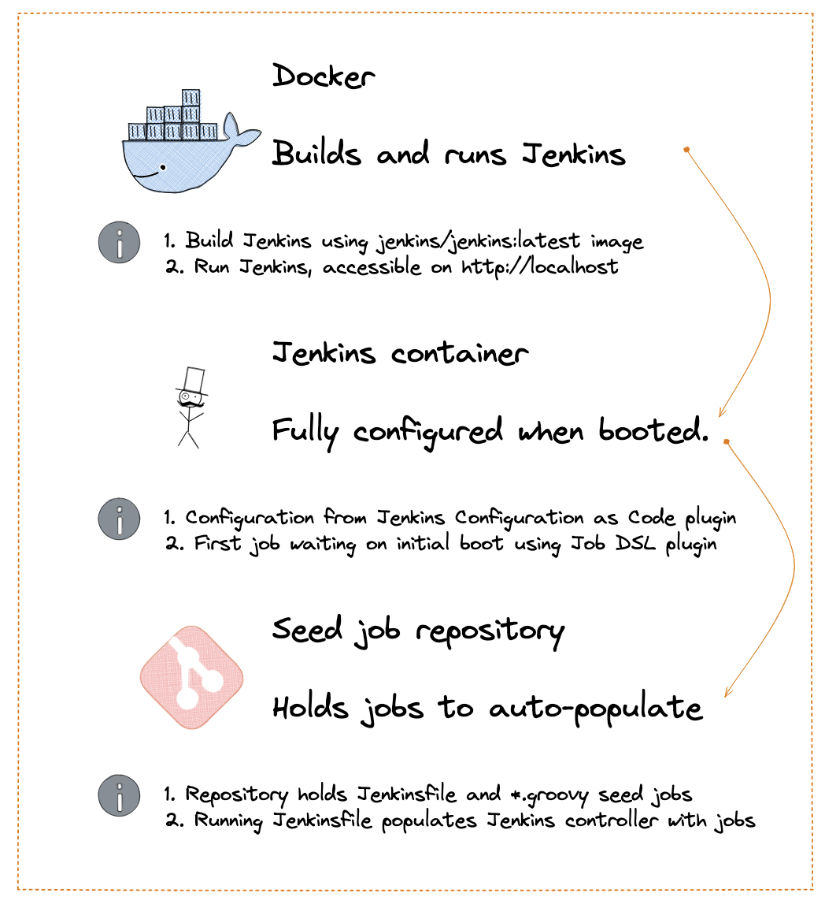
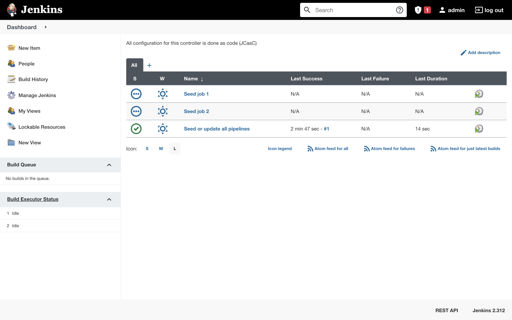

# Automatically set up Jenkins jobs from a git repository (JCasC & JobDSL plugin)
Jenkins is an automation server used by development teams for CI/CD processes. It takes quite some work to properly configure Jenkins and the pipelines for automating software deployment. This blog details how to simultaneously automate and version control the setup of Jenkins Pipelines and is aimed at slightly advanced Jenkins users. 

> "Jenkins is a wonderful system for managing builds, and people love using its UI to configure jobs. Unfortunately, as the number of jobs grows, maintaining them becomes tedious, and the paradigm of using a UI falls apart." - [from the repo](https://github.com/jenkinsci/job-dsl-plugin).

## Goal of this blog
The goal of this blog is that, once you start your Jenkins container, you can just press play to let Jenkins set up the necessary jobs. These jobs are checked into a code repository and that has a ton of benefits. The configuration can be audited and easily replicated if the Jenkins server goes down or has to be migrated for some reason. Changes in job configuration can then be deployed *through* a pipeline and all the replicative work of setting up pipelines is automated. A high-level overview of the setup looks like this:



## Contents
1. Getting started: test your setup (Docker)
2. Seed job included in Configuration as Code setup (JCasC/JobDSL)
3. Create seed job repository (Jenkinsfile/JobDSL)
4. Result: Jenkins is populated with jobs by running the seed job
5. Why the initial job needs to be started manually

## 1. Getting started: test your setup (Docker)
This blog builds on the concept of the `Jenkins Configuration as Code` plugin and it requires some basic proficiency with Docker. Although this blog can be read independent from my previous Jenkins blog, you might want to [have a look](https://techspire.nl/jenkins-inception-configuring-jenkins-to-configure-jenkins/) there if this concept new for you. I use `zsh` on a mac, so you might have to adjust some of the terminal code snippets if you are on a different platform.

To get started, clone the following [repository](https://github.com/m-goos/jenkins-configuration-as-code-blog) and go to the `blog2-code` directory to follow along:
```zsh
$ git clone https://github.com/m-goos/jenkins-configuration-as-code-blog

$ cd blog2-code
$ ls
Dockerfile
controller-configuration-jobDSL.yaml
plugins.txt
```

Now let us do a quick check of your environment and setup. You should be able to run the following container that can be built from the `Blog2-code` directory:
```sh
# start Docker or the docker-daemon
$ pwd
/Users/marc/projects/blog-jenkins-configuration-as-code/blog2-code

$ docker pull jenkins/jenkins:latest
latest: Pulling from jenkins/jenkins 

$ docker build -t jenkins:jobdsl-blog-2 .
[+] Building 0.2s (9/9) FINISHED                                                                                                                                          
 => [internal] load build definition from Dockerfile
 => => transferring dockerfile: 353B
 => [internal] load .dockerignore
 => => transferring context: 2B
 => [internal] load metadata for docker.io/jenkins/jenkins:latest
 => [1/4] FROM docker.io/jenkins/jenkins:latest
 => [internal] load build context
 => => transferring context: 1.92kB
 => CACHED [2/4] COPY plugins.txt /usr/share/jenkins/ref/plugins.txt
 => CACHED [3/4] RUN /usr/local/bin/install-plugins.sh < /usr/share/jenkin
 => [4/4] COPY controller-configuration-jobDSL.yaml /var/jenkins.yaml
 => exporting to image
 => => exporting layers
 => => writing image sha256:d7cdd9f5ffdafce3bc141363b1b463ccddce065da62b4
 => => naming to docker.io/library/jenkins:jobdsl-blog-2
```

Now finally run the Jenkins container, refer to [Blog 1](https://techspire.nl/jenkins-inception-configuring-jenkins-to-configure-jenkins/) in this series if you are looking for an explanation for the flags/options I'm using here:
```
$ docker images
REPOSITORY        TAG             IMAGE ID       CREATED         SIZE
jenkins           jobdsl-blog-2   d7cdd9f5ffda   9 minutes ago   517MB

$ docker run --name jenkins --rm -p 80:8080 -d --env JENKINS_ADMIN_PASSWORD=password jenkins:jobdsl-blog-2
```

Now navigate to `http://localhost`, login with the following credentials:
- admin: `admin`
- password: `password`
- *to stop this container when you are done: `docker stop [CONTAINER-ID]`*

And find Jenkins waiting for you with a pre-configured pipeline!

> If you run this seed pipeline, your Jenkins server will be populated with pipeline jobs you defined as code, straight from github!


How cool is that..!? Well, let us get to how this works.

## 2. Seed job included in Configuration as Code setup (JCasC/JobDSL)
After the Jenkins container started, a seed job was waiting. This seed job was defined in the `Configuration as Code` script for the controller. When running the `docker build` command, the configuration file is copied into the Jenkins container and used to configure Jenkins on the first startup. This configuration part is done using the Configuration as Code plugin - as I pointed out earlier, feel free to have a look at my previous blog for that 😉

Now the second part of the automated setup happens thanks to the JobDSL plugin ([find it on github](https://github.com/jenkinsci/job-dsl-plugin)). In the configuration template, an initial job is defined. This job then points to a repository that holds a bunch of these jobs:

I think this is really cool, because it basically leaves you with nothing much to do, except for clicking on `Build Now`:

```yaml
jobs:
    - script: >
        pipelineJob("Seed or update all pipelines") {
        definition {
            cpsScm {
                scm {
                    git{
                      remote {
                        url("https://github.com/m-goos/jenkins-jobdsl-seedrepo-example.git")
                      }
                      branch("*/main")
                    }
                }
            }
          }
        }
```

The result is the screenshot above. Find this snippet in the folder `blog2-code` in the `controller-configuration.yaml` file, to see how it fits in the configuration file.

No ssh credentials were used to simplify this example. In a production example you would use SSH keys to check out a repository. For that, add a `credentials` block below the url that points to git ([see documentation for](https://jenkinsci.github.io/job-dsl-plugin/#method/javaposse.jobdsl.dsl.helpers.workflow.CpsScmContext.scm) `scm > git > remote > credentials`). There you can specify the credentials as they have been defined in Jenkins.


----
**TO BE FINALIZED FROM HERE ON:**
## 3. Create seed job repository (Jenkinsfile/JobDSL)
With the seed job added to the configuration file of the controller, the next step is to create a repository that holds the seed jobs. For this blog I created a public repository that holds a Jenkinsfile and two `seed.groovy` files. The seed repository looks like this:
```
jenkins-jobdsl-seedrepo-example

 ┣ Jenkinsfile
 ┣ README.md
 ┣ seed1.groovy
 ┗ seed2.groovy
```

When `Seed or update all pipelines` is run, it generates a job for every `.groovy` file in the specified path. 

`Jenkinsfile:`
```
pipeline {
    agent any 
    stages {
        stage('Pipeline to seed or update all pipelines') {
            steps {
                jobDsl  targets: ['*.groovy'].join('\n')
            }
        }
    }
}
```

Have a look at the JobDSL [wiki](https://github.com/jenkinsci/job-dsl-plugin/wiki/User-Power-Moves#use-job-dsl-in-pipeline-scripts) for the configuration options and to understand the behavior of the plugin. For example, `ignoreExisting` defaults to false, so existing jobs and views will be updated when the seed pipeline is re-run. 

## 4. Result: Jenkins is populated with jobs by running the seed job
Finally, it is time to run the seed job. This is the job output:

```
Commit message: "add seed for seed-job-2"
[Pipeline] }
[Pipeline] // stage
[Pipeline] withEnv
[Pipeline] {
[Pipeline] stage
[Pipeline] { (Pipeline to seed or update all pipelines)
[Pipeline] jobDsl
Processing DSL script seed1.groovy
Processing DSL script seed2.groovy
Added items:
    GeneratedJob{name='Seed job 1'}
    GeneratedJob{name='Seed job 2'}
[Pipeline] }
[Pipeline] // stage
[Pipeline] }
[Pipeline] // withEnv
[Pipeline] }
[Pipeline] // node
[Pipeline] End of Pipeline
Finished: SUCCESS
```

Success! 🎉 After refreshing the homepage of the controller, it now has two extra jobs:



## 5. Why the initial job needs to be started manually
Ideally, the seed job would be run once the controller is done starting up. That seemed simple enough, using the jobDSL queue command. The command can `queue` the seed job to be run once the controller is in its *ready* state, added below the declaration of our initial job:
```sh
# controller-configuration.yaml
- script: queue("Seed or update all pipelines")
```

However, that runs into a chicken-and-egg problem between Jenkins starting up and queueing. The queue is cleared at some point when Jenkins is ready, by definition, but the queue should only be started after Jenkins is ready.. Get it? If that peaks your interest, have a look at these issues on github, describing the problen [[1](https://github.com/jenkinsci/configuration-as-code-plugin/issues/280)] [[2](https://github.com/jenkinsci/configuration-as-code-plugin/issues/199)] [[3](https://github.com/jenkinsci/configuration-as-code-plugin/issues/619)].

## Next steps: secrets and private repositories
A natural next step after this working prototype would be to start adding credentials to the Configuration as Code setup and to check out a private seed repository. The `controller-configuration-jobDSL.yaml` includes the setup for a credential, so that could be a good starting point. 

In the production setup I use, Jenkins gets its credentials from the secrets storage solution from AWS - this can be done using a Jenkins plugin and there are different authentication options. Getting your credentials from within the cloud cannot be tested from your machine, as the container runs in the AWS container service, but you will find the right steps outlined clearly on the blog of [Tom Gregory](https://tomgregory.com/inject-secrets-from-aws-into-jenkins-pipelines/) and the [plugin page](https://github.com/jenkinsci/aws-secrets-manager-credentials-provider-plugin/).

I hope you enjoyed this blog and have a good use case for this handy Jenkins plugin - please feel free to reach out with any feedback you have.

## WHO AM I?
I’m Marc, a full stack engineer at Techspire and I ride my bike in Amsterdam 🇳🇱 I have an engineering bachelor’s, an entrepreneurship master’s and when I am not coding, I am probably doing water sports.

Do you think you have what it takes to work with us? At Techspire we’re looking for people who love technology as much as we do, looking to push themselves to expand their knowledge. Also, we love a good story, a good laugh, and a few beers.