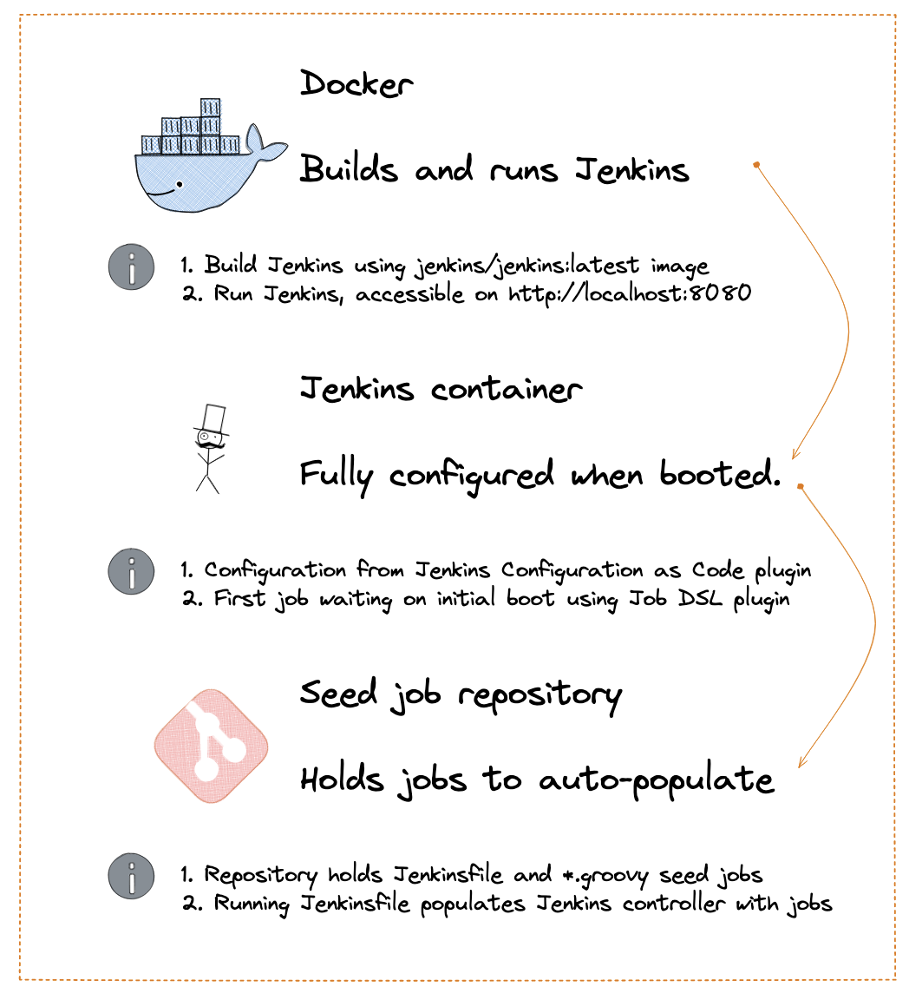
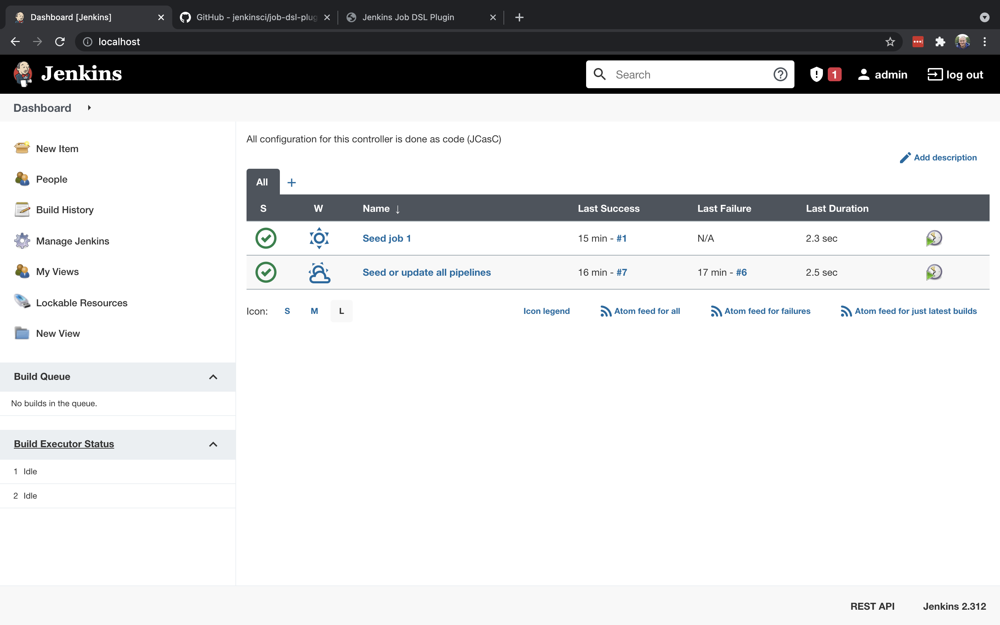

# Automatically set up Jenkins jobs from a git repository (JCasC & JobDSL plugin)
Jenkins is an automation server used by development teams for CI/CD processes. It takes quite some work to properly configure Jenkins and the pipelines for automating software deployment. This blog details how to simultaneously automate and version control the setup of Jenkins Pipelines and is aimed at slightly advanced Jenkins users. 

> "Jenkins is a wonderful system for managing builds, and people love using its UI to configure jobs. Unfortunately, as the number of jobs grows, maintaining them becomes tedious, and the paradigm of using a UI falls apart." - [from the repo](https://github.com/jenkinsci/job-dsl-plugin).

## Goal of this blog
The goal of this blog is that, once you start your Jenkins container, you can just press play to let Jenkins set up the necessary jobs. These jobs are checked into a code repository and that has a ton of benefits. The configuration can be audited and easily replicated if the Jenkins server goes down or has to be migrated for some reason. Changes in job configuration can then be deployed *through* a pipeline and all the replicative work of setting up pipelines is automated. A high-level overview of the setup looks like this:



## Contents
1. Getting started: test your setup (Docker)
2. Seed job included in Configuration as Code setup (JCasC/JobDSL)
3. Create seed job repository (Jenkinsfile/JobDSL)
4. Results: 

## 1. Getting started: test your setup (Docker)
This blog builds on the concept of the `Jenkins Configuration as Code` plugin and it requires some basic proficiency with Docker. Although this blog can be read independent from my previous Jenkins blog, you might want to [have a look](https://techspire.nl/jenkins-inception-configuring-jenkins-to-configure-jenkins/) there if this concept new for you. I use `zsh` on a mac, so you might have to adjust some of the terminal code snippets if you're on a different platform.

To get started, clone the following [repository](https://github.com/m-goos/jenkins-configuration-as-code-blog) and go to the `blog2-code` directory to follow along:
```zsh
$ git clone https://github.com/m-goos/jenkins-configuration-as-code-blog

$ cd blog2-code
$ ls
Dockerfile
controller-configuration-jobDSL.yaml
plugins.txt
```

Now let's do a quick check of your environment and setup. You should be able to run the following container that can be built from the `Blog2-code` directory:
```sh
# start Docker or the docker-daemon
$ pwd
/Users/marc/projects/blog-jenkins-configuration-as-code/blog2-code

$ docker pull jenkins/jenkins:latest
latest: Pulling from jenkins/jenkins 

$ docker build -t jenkins:jobdsl-blog-2 .
[+] Building 0.2s (9/9) FINISHED                                                                                                                                          
 => [internal] load build definition from Dockerfile
 => => transferring dockerfile: 353B
 => [internal] load .dockerignore
 => => transferring context: 2B
 => [internal] load metadata for docker.io/jenkins/jenkins:latest
 => [1/4] FROM docker.io/jenkins/jenkins:latest
 => [internal] load build context
 => => transferring context: 1.92kB
 => CACHED [2/4] COPY plugins.txt /usr/share/jenkins/ref/plugins.txt
 => CACHED [3/4] RUN /usr/local/bin/install-plugins.sh < /usr/share/jenkin
 => [4/4] COPY controller-configuration-jobDSL.yaml /var/jenkins.yaml
 => exporting to image
 => => exporting layers
 => => writing image sha256:d7cdd9f5ffdafce3bc141363b1b463ccddce065da62b4
 => => naming to docker.io/library/jenkins:jobdsl-blog-2
```

Now finally run the Jenkins container, refer to [Blog 1](https://techspire.nl/jenkins-inception-configuring-jenkins-to-configure-jenkins/) in this series if you're looking for an explanation for the flags/options I'm using here:
```
$ docker images
REPOSITORY        TAG             IMAGE ID       CREATED         SIZE
jenkins           jobdsl-blog-2   d7cdd9f5ffda   9 minutes ago   517MB

$ docker run --name jenkins --rm -p 80:8080 --env JENKINS_ADMIN_PASSWORD=password jenkins:jobdsl-blog-2
```

Now navigate to `http://localhost`, login with the following credentials:
- admin: `admin`
- password: `password`

And find Jenkins waiting for you with a pre-configured pipeline!

> If you run this pipeline, your Jenkins server will be populated with a bunch of different pipeline jobs, straight from github!


How cool is that..!? Well, let's get to how this works.

## 2. Seed job included in Configuration as Code setup (JCasC/JobDSL)
After the Jenkins container started, a seed job was waiting. This seed job was defined in the `Configuration as Code` script for the controller. When running the `docker build` command, the configuration file is copied into the Jenkins container and used to configure Jenkins on the first startup. This configuration part is done using the Configuration as Code plugin - as I pointed out earlier, feel free to have a look at my previous blog for that 😉

Now the second part of the automated setup happens thanks to the JobDSL plugin ([find it on github](https://github.com/jenkinsci/job-dsl-plugin)). In the configuration template, an initial job is defined. This job then points to a repository that holds a bunch of these jobs:

I think this is really cool, because it basically leaves you with nothing much to do, except for clicking on `Build Now`:

```yaml
jobs:
    - script: >
        pipelineJob("Seed or update all pipelines") {
        definition {
            cpsScm {
                scm {
                    git{
                      remote {
                        url("https://github.com/m-goos/jenkins-jobdsl-seedrepo-example.git")
                      }
                      branch("*/main")
                    }
                }
            }
          }
        }
```

The result is the screenshot above. Find this snippet in the folder `blog2-code` in the `controller-configuration.yaml` file, to see how it fits in the configuration file.

As you might notice, no ssh credentials were used to simplify this example. In a production example you would of course use SSH keys to check out a repository. For that, add a `credentials` block below the url that points to git ([see documentation for](https://jenkinsci.github.io/job-dsl-plugin/#method/javaposse.jobdsl.dsl.helpers.workflow.CpsScmContext.scm) `scm > git > remote > credentials`). There you can specify the credentials with as they have been defined in Jenkins.


----
**TO BE FINALIZED FROM HERE ON:**
## 3. Create seed job repository (Jenkinsfile/JobDSL)
- created a seed job repo
- show syntax and how it stitches together a bunch of groovy files
- show screenshot of succesfull run of seed job-1 and seed job -2



**EVT NOG INSPIRATIE HALEN UIT DE ANDERE DOCUMENTATIE DIE IK GESCHREVEN HEB**


## Why I haven't realized a 'fully' automated setup
Ideally, the seed job would be run 

jobDsl queue is a bit flaky and runs into a chicken-egg problem with Jenkins startup and queueing.
see https://github.com/jenkinsci/configuration-as-code-plugin/issues/280
see also https://github.com/jenkinsci/configuration-as-code-plugin/issues/619
- script: queue("initialize-pipelines")

## Next steps
- create credentials for external git repository
- check out external git repository
